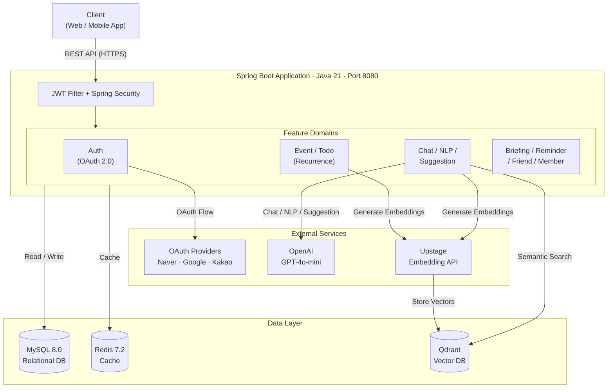

# Calio Backend

**AI 기반 개인 일정 관리 서비스의 백엔드 서버입니다.**  
자연어 입력, AI 채팅, 벡터 시맨틱 검색을 통해 스마트한 일정 관리를 제공합니다.

## 시스템 아키텍처

## 기술 스택

| 분류 | 기술 |
|------|------|
| Language | Java 21 |
| Framework | Spring Boot 4.0.1, Spring Security, Spring Data JPA |
| Database | MySQL 8.0, Redis 7.2, Qdrant (Vector DB) |
| AI / NLP | OpenAI GPT-4o-mini, Upstage Embedding API |
| Auth | JWT, OAuth 2.0 (Naver · Google · Kakao) |
| Infra | Docker, Docker Compose |
| Docs | Swagger / OpenAPI |

## 주요 기능

- **AI 채팅**: GPT-4o-mini 기반 일정 관리 챗봇
- **자연어 파싱 (NLP)**: 자연어 문장에서 일정/할 일 자동 추출
- **AI 제안**: 사용자 패턴 기반 일정 및 할 일 자동 추천
- **시맨틱 검색**: 벡터 임베딩을 활용한 의미 기반 일정 검색
- **반복 일정**: RRULE 기반 복잡한 반복 규칙 지원
- **소셜 기능**: 친구 연결 및 일정 공유
- **브리핑**: 일일 일정 요약 제공

## 커밋 메시지 컨벤션

| Tag | Description |
| --- | --- |
| ✨ `Feature` | 새로운 기능 추가 |
| ♻️ `Refactor` | 버그 수정 |
| 📝 `Docs` | 문서 추가, 수정, 삭제 |
| ✅ `Test` | 테스트 코드 추가, 수정, 삭제 |
| 🎨 `Style` | 마크업 및 스타일 변경 |
| 🐛 `Refactor` | 코드 리팩토링 |
| 🧹 `chore` | 개발 환경 설정 관련 변경 |
| 🚀 `Deploy` | 배포 관련 변경 사항 |
| 💻 `CrossBrowsing` | 브라우저 호환성 관련 변경 |
